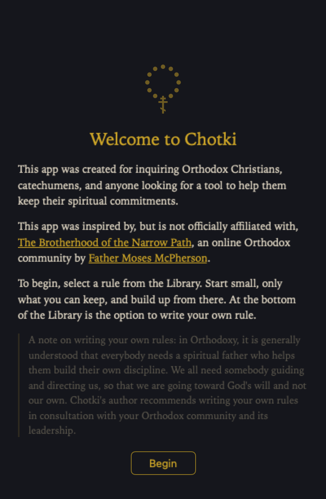
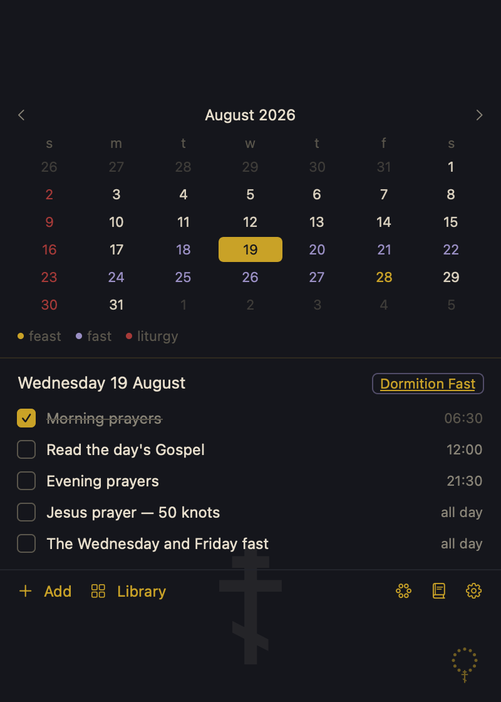
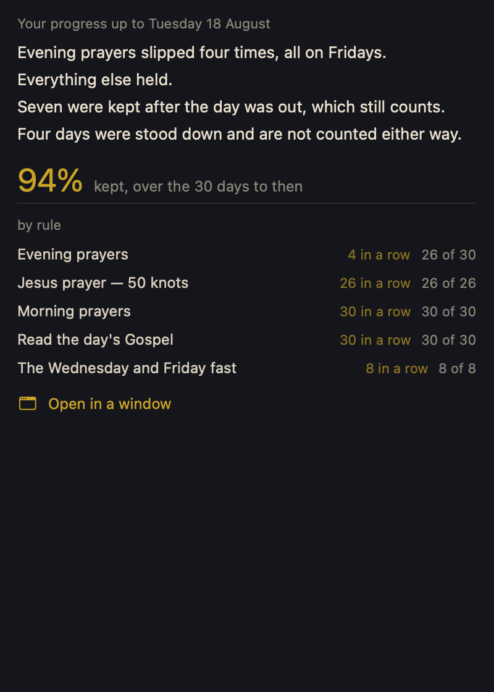
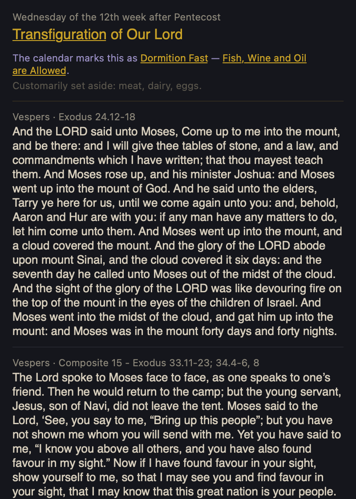
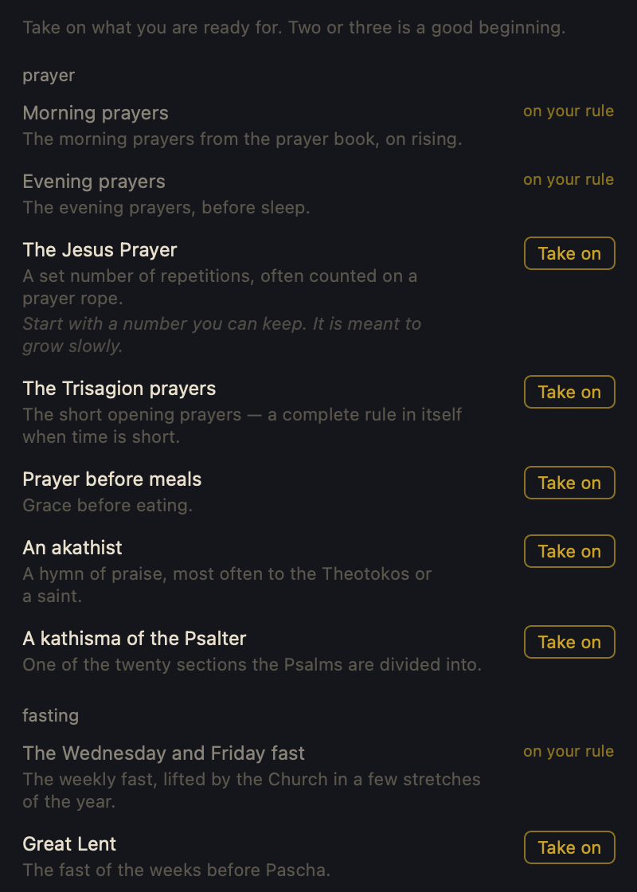
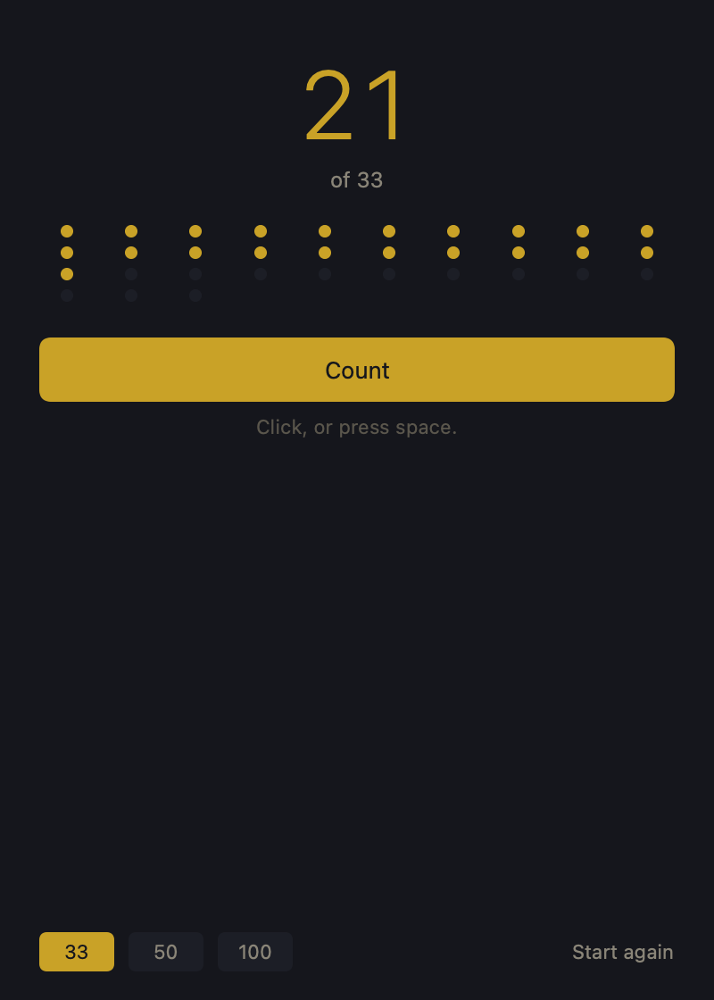

# Chotki (alpha)

An app for keeping an Orthodox routine, and honestly measuring whether it is kept, to help you hold yourself accountable.

A calendar tells you what is scheduled. This tells you what you actually kept, over time — without turning practice into a scoreboard.

You can add custom items to your practice which may not be Church canon, but are part of your Orthodox community — such as [The Brotherhood of the Narrow Path](https://www.skool.com/fathermoses/), who inspired this app.

> Chotki is an independent project. It was inspired by The Brotherhood of the Narrow Path, but it is not sanctioned by, affiliated with, or endorsed by them, and nothing in it should be taken as speaking for them.

## Status

**Alpha.** It runs, and it is in daily use by its author. It has not been used by anyone else yet.

What that means in practice:

- **Android is available**, OS version Android 8 / API 26 or later. Strictly sideload for now, see [Getting it](#android).
- **macOS is available** — macOS 13 or later, Apple Silicon and Intel. The Intel half is built but has never been run on an Intel Mac. Signed by its author rather than notarised by Apple, so macOS will refuse to open it until you allow it in Privacy and Security. See [Getting it](#getting-it).
- iOS is in development and a Linux version is planned.
- The glossary and the passages from the Fathers are introductory and await a priest's review. **Do not treat them as authoritative.**

- [design.md](design.md) — data model, liturgical handling, scoring
- [checklist.md](checklist.md) — build order, phase by phase
- [mockup.html](mockup.html) — the interface
- [plan.html](plan.html) — the full plan, formatted

## What it looks like

  

**The welcome**, shown once and then not again. Who the app is for, what it is not affiliated with, and where to begin — start small, only what you can keep. The note set apart is about spiritual direction: writing your own rule is something to do with your community and its leadership, not alone.

  
  

**The day's rule**, and **progress**. The month is shaded by the church calendar — violet for fasting days, gold for great feasts, ochre for Sundays. Progress leads with what happened in words, notices patterns on its own, and puts the figure second. It covers finished days only; today is never judged.

  
  

**The day's reading**, and **the library**. Commemoration, what the calendar marks, and the appointed readings — with unfamiliar terms underlined and tappable, so the explanation is one click from the word. Nothing in the library is switched on until you choose it.

  

**The prayer rope.** Thirty-three, fifty or a hundred, counted by click or spacebar, with a chime when the knot is complete — so you can pray with your eyes closed.

## What it does

- Schedule rules — daily, weekly, monthly, or tied to the liturgical calendar
- Take rules on one at a time from a library, or write your own. Nothing is enabled by default
- Pause a rule without penalty; paused days are skipped, never counted as missed
- Track consistency, weighted to the last 30 days, reported as prose before figures
- Notify ahead of timed rules, and bounded reminders for untimed ones
- Show the day's commemoration, fasting rule, and scripture readings
- Explain the words — a glossary of around 120 terms, scoped to your tradition, tappable where they appear
- Read the prayers themselves — the rules carry their texts, and the rope offers a choice of what to pray
- Count the Jesus Prayer on a prayer rope, with a chime when the knot is complete
- Keep a daily backup of your record, and export or restore it whenever you like

## Calendar

Both reckonings are supported and the setting is configurable. The default is Julian (Old Calendar), which is used by roughly 110 million Orthodox Christians against roughly 47 million on the Revised Julian calendar.

Julian and Gregorian reckoning do not affect days of the week — the Wednesday and Friday fast rhythm is identical under both. Only fixed feasts differ, by 13 days. The movable cycle, Pascha included, is the same for both, because nearly every Orthodox church computes Pascha on the Julian reckoning.

The app always displays civil Gregorian dates. Reckoning is a lookup layer, never a display layer.

## Architecture

`core/` is a pure SwiftPM package — Foundation and SQLite only, no Apple-only imports. It holds the data model, recurrence expansion, scoring, the liturgical client, and the scheduler. It builds and tests on macOS, Linux, and Windows.

`macos/` is the SwiftUI menu bar app, and the only Apple-specific code in the project. Platform services — notifications, launch at login, tray presentation — sit behind protocols defined in `core/`.

Core tests run on Linux in CI from the first phase, so portability fails loudly rather than rotting quietly.

## Data

Liturgical data comes from [orthocal.info](https://orthocal.info), a free public JSON API. No key, no account. It is the only network call the app makes: no analytics, no telemetry, no sync. Everything is stored locally in SQLite and backed up by JSON export.

## A note on tone

The app is deliberately encouraging and never shaming. There is no red anywhere in the progress view, no "failed", no broken-streak language, and no comparison against a target or a better past self. Pausing a rule removes those days from the record rather than counting them against you, and the consistency figure can be hidden entirely, leaving only the prose.

That is a fixed constraint rather than a style choice, and it is enforced by tests.

## Getting it

### macOS

**macOS 13 or later.** The download is a universal binary, so it carries code for both Apple Silicon and Intel.

> **The Intel half has never been run.** It is built and signed alongside the Apple Silicon one and nobody here owns an Intel Mac to open it on. If you are on Intel and it does not start, that is worth telling us about — and please check step 4 below first, because a Mac refusing an unnotarised app and a Mac unable to run a binary look exactly the same from the outside.

1. Download `Chotki.zip` from the [releases page](../../releases) and unzip it.
2. Drag **Chotki.app** into your Applications folder.
3. Open it. **macOS will refuse the first time** — this is expected, and is explained below.
4. Go to **System Settings › Privacy & Security**, scroll down, and next to the message about Chotki click **Open Anyway**. Confirm.
5. It will ask permission to send notifications. Allow it if you want reminders; the app works either way.

A cross appears in your menu bar, and a window opens. Nothing is switched on until you choose something from the library.

To check which half you are running: `lipo -archs /Applications/Chotki.app/Contents/MacOS/Chotki` lists both, and `uname -m` says which one your Mac will use — `arm64` for Apple Silicon, `x86_64` for Intel.

#### Why macOS blocks it

Because this build is signed by its author rather than notarised by Apple, which costs a hundred dollars a year and is not worth it for an alpha. macOS cannot tell an unnotarised app from a harmful one, so it refuses both. The source is here to read if you would rather check it yourself, and the whole app is built by the script in `macos/build-app.sh` if you would rather build it than trust a download.

#### Removing it

Drag the app to the trash. Your record lives in `~/Library/Application Support/Chotki` — delete that folder too if you want it gone, or keep it and it will be there if you reinstall.

### Android

**Android 8 or later**, which is effectively every phone still in use.

You do **not** need developer mode, USB debugging, or Android Studio. Those are
for building the app, not for running it, and turning them on is what upsets
banking apps — installing an apk does not.

1. Download `chotki-<version>.apk` onto the phone from the
   [releases page](../../releases).
2. Open it — from the notification, or from Files › Downloads.
3. Android will say it cannot install apps from this source. Tap **Settings**
   on that prompt, turn on **Allow from this source** for whatever app you
   opened it with (usually Files or Chrome), and go back.
4. Tap **Install**. Play Protect may add a second warning about an unrecognised
   developer — **Install anyway**.
5. Open it. It asks permission to send notifications; allow it if you want
   reminders, and the app works either way.

Nothing is switched on until you choose something from the library.

#### If reminders stop arriving after a day or two

Android puts apps it thinks you have stopped using to sleep, and Samsung, Xiaomi
and OnePlus each keep a second list of their own on top of that. Settings ›
Reminders inside Chotki names the three switches, says which are set, and each
one opens the Android screen where it is actually changed. On Samsung the extra
one is Settings › Battery › Background usage limits › Never sleeping apps, and
no app can read or set it for you.

#### Why Android warns about it

The same reason macOS does. The apk is signed by its author rather than
distributed through Google Play, and Android cannot tell an app signed by
someone it does not know from a harmful one, so it warns about both. The source
is here to read, and `android/RELEASE.md` builds it if you would rather build it
than trust a download.

#### Removing it

Press and hold the icon, then Uninstall. Your record goes with it — Android
gives an app no place to leave anything behind — so if you plan to reinstall,
it will start empty.

## Licence

Not open source. The source is published so it can be read and audited, not reused.

During the alpha you may build, install and run it freely for your own use. You may not sell it, redistribute it, or reuse its source in another project. Chotki is intended to become a paid application, with the proceeds going to the author's church or to causes chosen by it.

See [LICENSE](LICENSE) for the full terms.
