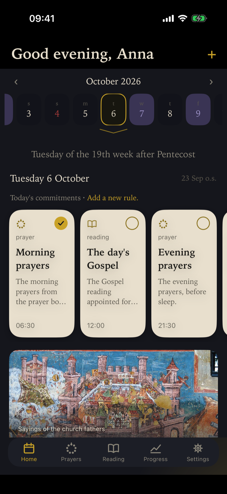
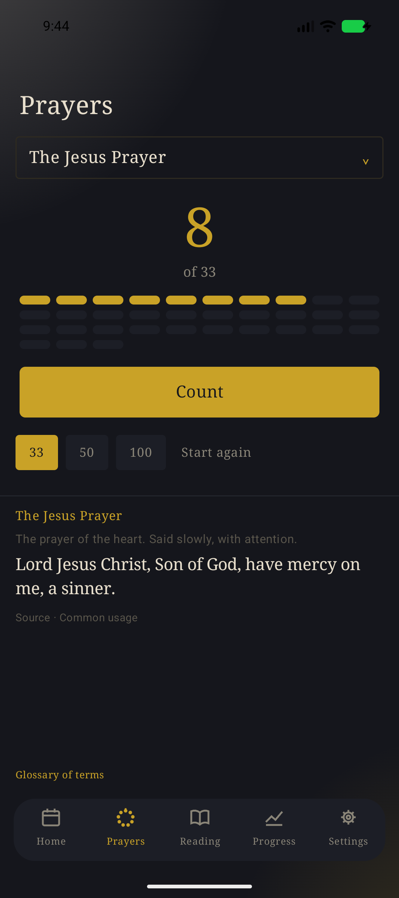
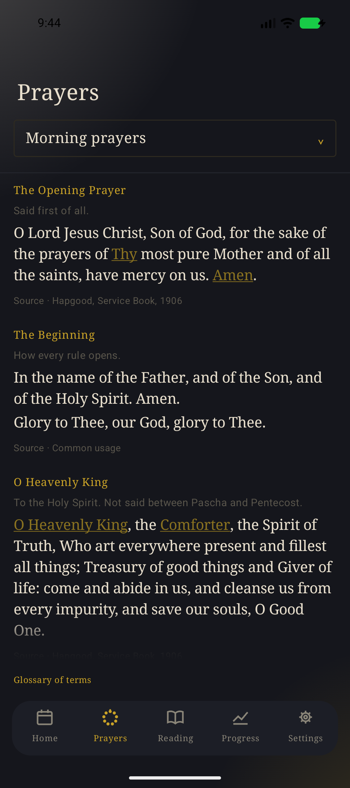
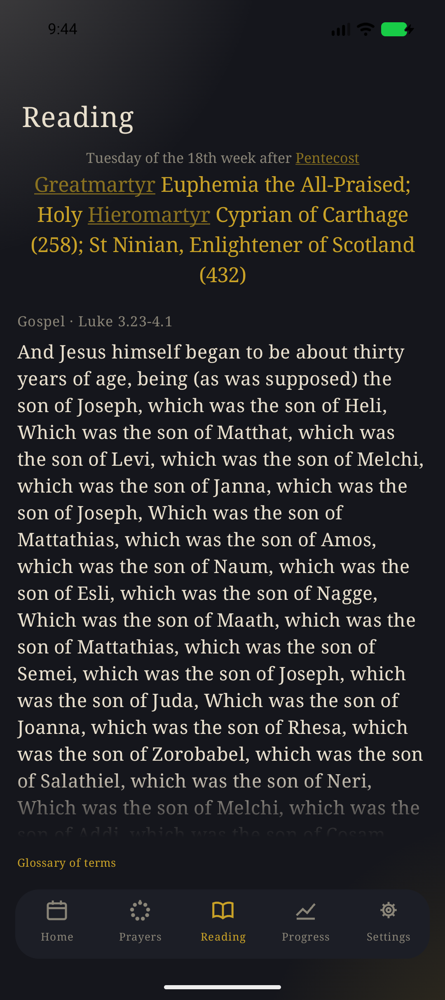
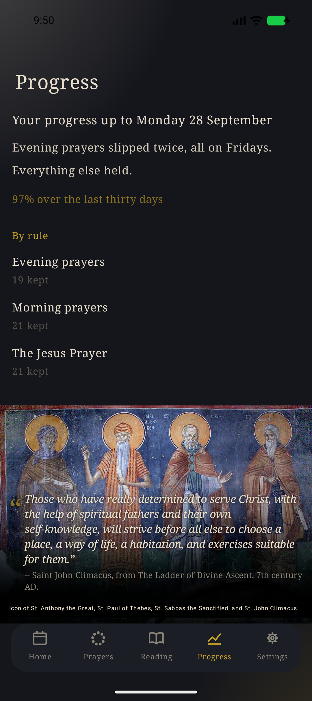
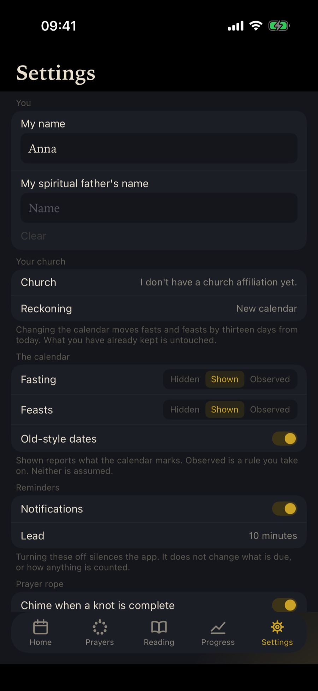
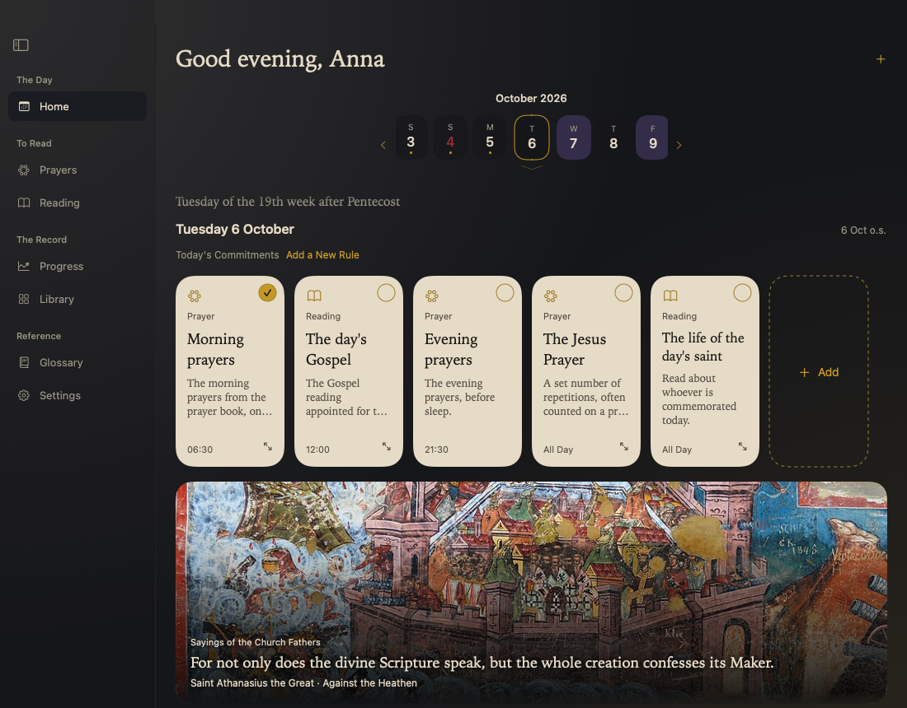

# Chotki

An app for keeping an Orthodox routine, and honestly measuring whether it is kept, to help you hold yourself accountable.

A calendar tells you what is scheduled. This tells you what you actually kept, over time, without turning practice into a scoreboard.

You can add items of your own, whether or not they are Church canon, so that a rule shaped by your community or your circumstances can be held in one place alongside the rest.

> **An independent project.** Chotki is not affiliated with or sanctioned by any church, parish, jurisdiction, or community. Nothing in it carries anyone's blessing.
>
> It is not a spiritual father and is not meant to stand in for one. If you have a priest or a spiritual father, settle your rule with him and let this app do nothing more than remember it. If you do not yet have one, treat what is here as a beginning rather than an authority, and go on looking.
>
> To give new and existing Orthodox Christians a way to build their practice before they find a spiritual father, to encourage finding one, and to facilitate that relationship once one is found.

## Status

**1.0 beta, build 30.**

- **Android** — Android 8 / API 26 or later. Sideload for now; see [Getting it](#android). In daily use by its author.
- **macOS** — macOS 13 or later, Apple Silicon and Intel in one universal download. The Intel half is built but has never been run on an Intel Mac. Signed by its author rather than notarised by Apple, so macOS will refuse to open it until you allow it in Privacy and Security. See [Getting it](#getting-it).
- **iOS** — not a public download. A free Apple developer account cannot use TestFlight, and a phone build signed that way stops opening after seven days.
- **Windows** — an x86_64 Windows 11 alpha, [alpha-rc3-build35](https://github.com/rjmac83/chotki/releases/tag/windows-alpha-rc3-build35), published as a prerelease. See [Windows status](windows/README.md).

The glossary and the passages from the Fathers are introductory and await a priest's review. **Do not treat them as authoritative.**

## What it looks like

  
  
  

**Home** and **Prayers.** Home holds the week and the day's commitments as cards; a circle on each marks it kept. A counted prayer brings the rope: thirty-three, fifty or a hundred knots, with the words underneath. A prayer that is read does not; the menu at the top switches between them.

  
  
  

**Reading, Progress and Settings.** Reading is the commemoration and the appointed passages, each section opening on its own. Progress leads with what happened in words, puts the figure second, and stops at yesterday; today is never judged. Settings holds your name, your church and reckoning, and how much of the calendar you want shown.

  

**On the Desktop**, the same screens sit in a window with a sidebar, and a cross in the menu bar opens a smaller companion.

## What it does

- Schedule rules — daily, weekly, monthly, or tied to the liturgical calendar
- Take rules on one at a time from a library, or write your own. Nothing is enabled by default
- Pause a rule without penalty; paused days are skipped, never counted as missed
- Track consistency, weighted to the last 30 days, reported as prose before figures
- Notify ahead of timed rules, and bounded reminders for untimed ones
- Show the day's commemoration, fasting rule, and scripture readings
- Explain the words — a glossary of around 120 terms, scoped to your tradition, tappable where they appear
- Read the prayers themselves — the rules carry their texts, and the rope offers a choice of what to pray
- Count the Jesus Prayer on a prayer rope, with a chime when the knot is complete
- Keep a daily backup of your record, and export or restore it whenever you like

## Calendar

Chotki does not compute the church calendar itself. Every fast, feast, tone, commemoration and appointed reading comes from [Orthocal.info](https://orthocal.info), so the app can show what Orthocal knows and nothing else. This is a limit worth understanding.

**What Orthocal provides.** Orthocal.info is an Eastern Orthodox calendar service giving commemorations, fasting, scripture readings and other information for each day of the liturgical year. It supports two traditions, each on either the New (Revised Julian) or the Old (Julian) calendar:

- **Slavic**, reflecting the practice of the Orthodox Church in America (OCA) and the Russian Orthodox Church Outside of Russia (ROCOR). Its fasting indications follow the OCA's *Fasting & Fast-Free Seasons of the Church*.
- **Greek**, reflecting the practice of the Antiochian Archdiocese and the Greek Orthodox Archdiocese. The two traditions keep the same fasting seasons, but differ on a handful of days a year, on a more lenient first phase of the Nativity Fast, and on a few additional wine-and-oil allowances in Great Lent.

Orthocal itself says its purpose is convenient access to daily devotional material for lay people, not to be an authoritative or comprehensive guide to the feasts and fasts of the Church. Chotki presents this data with the same spirit and intent.

**What that means here.**

- **The bundled calendar is the Slavic tradition.** Choosing a church in Settings sets the reckoning, Old or New, the Akathist Fridays and the practice notes, but it does not switch the calendar to that church's own typikon. Someone in a Greek or Antiochian parish will see the Slavic fasting marks and readings, and should expect them to differ from their parish on some days.
- **A church calendar is more than the lectionary.** Local feasts, patronal days, and a parish's or bishop's own arrangements are not in Orthocal and are not in Chotki.
- **Where Orthocal is silent, so is Chotki.** Chotki reports what the calendar marks. It does not tell anyone what to do, and it never issues dietary instruction. For what your church asks of you, ask your priest.

**Reckoning.** Both the Old and the New calendar are supported and the setting is yours to change. With no church named, the app follows the OCA: New Calendar, Slavic tradition, without showing the OCA as your church.

Julian and Gregorian reckoning do not affect days of the week; the Wednesday and Friday fast rhythm is identical under both. Only fixed feasts differ, by 13 days. The movable cycle, Pascha included, is the same for both, because nearly every Orthodox church computes Pascha on the Julian reckoning. The app always displays civil Gregorian dates.

## Architecture

`core/` is a pure SwiftPM package — Foundation and SQLite only, no Apple-only imports. It holds the data model, recurrence expansion, scoring, the liturgical client, and the scheduler. It builds and tests on macOS, Linux, and Windows.

`macos/` is the SwiftUI main-window and menu-bar app. `ios/` is the SwiftUI iPhone app and uses the same core. `android/` contains the Kotlin core reimplementation and Jetpack Compose interface. Shared-content checks keep their bundled texts in step. Platform services sit behind core protocols.

Core tests run on Linux in CI from the first phase, so portability fails loudly rather than rotting quietly.

## Data

**The church calendar.** Fasts, feasts, tones, commemorations and the appointed readings come from [Orthocal.info](https://orthocal.info) and its open-source code (MIT licence). Chotki ships with five years of that calendar (2026–2031), under both the Old and the New reckoning, generated from Orthocal's own code and carried inside the app, so those days need no network at all.

Our sincere thanks to the Orthocal project and everyone who has contributed to it. Chotki's calendar rests on their work.

**What is not carried over.** Where Orthocal's content is not in the public domain, it is not used; a public-domain equivalent is substituted in its place. That covers Orthocal's saints' lives, and the Composite readings, whose translation is under copyright: those readings now show the King James text of the chapters they cite.

**Scripture** is the King James Version with the Apocrypha, public domain, from [eBible.org](https://ebible.org). **The passages from the Fathers** are from translations published between 1885 and 1900, public domain. **The prayers** are older public-domain liturgical English, chiefly the Hapgood Service Book of 1906. **The glossary** and the other explanatory text are the author's own.

**Network and privacy.** For dates after 2031 the app asks orthocal.info, the only network call any version makes. No key, no account, no analytics, no telemetry, no sync. Your record is stored locally in SQLite and backed up by JSON export. We will push updated bundles with future releases, in order that Chotki's calendar can extend beyond 2031 without API dependency.

**Lives of the saints.** The daily life of the saint is from the *Prologue from Ochrid* by St. Nikolai Velimirović, taken from [app.ochrid.com](https://app.ochrid.com) and used under the [Creative Commons Attribution-ShareAlike 4.0 licence (CC BY-SA 4.0)](https://creativecommons.org/licenses/by-sa/4.0/). The text is shown unchanged, and each reading carries a link to its source page and to the licence. These texts remain under CC BY-SA 4.0; that licence applies to them, not to the rest of the software. There are 365 church-date entries; the source has no February 29 reading.

**Artwork.** The daily picture comes from a shared rotation of 365 public-domain images.

## Getting it

### macOS

**macOS 13 or later.** The download is a universal binary, so it carries code for both Apple Silicon and Intel.

> **The Intel half has never been run.** It is built and signed alongside the Apple Silicon one and nobody here owns an Intel Mac to open it on. If you are on Intel and it does not start, that is worth telling us about — and please check step 4 below first, because a Mac refusing an unnotarised app and a Mac unable to run a binary look exactly the same from the outside.

1. Download `Chotki.zip` from the [releases page](../../releases) and unzip it.
2. Drag **Chotki.app** into your Applications folder.
3. Open it. **macOS will refuse the first time** — this is expected, and is explained below.
4. Go to **System Settings › Privacy & Security**, scroll down, and next to the message about Chotki click **Open Anyway**. Confirm.
5. It will ask permission to send notifications. Allow it if you want reminders; the app works either way.

To check which half you are running: `lipo -archs /Applications/Chotki.app/Contents/MacOS/Chotki` lists both, and `uname -m` says which one your Mac will use — `arm64` for Apple Silicon, `x86_64` for Intel.

#### Why macOS blocks it

This build is signed by its author rather than notarised by Apple. MacOS cannot tell an unnotarised app from a harmful one, so it refuses both. The source is here to read if you would rather check it yourself, and the whole app is built by the script in `macos/build-app.sh` if you would rather build it than trust a download.

#### Removing it

Drag the app to the trash. Your record lives in `~/Library/Application Support/Chotki` — delete that folder too if you want it gone, or keep it and it will be there if you reinstall.

### Android

**Android 8 or later**, which is effectively every phone still in use.

You do **not** need developer mode, USB debugging, or Android Studio. Those are
for building the app, not for running it, and turning them on is what upsets
banking apps — installing an apk does not.

1. Download `Chotki-1.0-beta.30.apk` onto the phone from the
   [releases page](../../releases).
2. Open it — from the notification, or from Files › Downloads.
3. Android will say it cannot install apps from this source. Tap **Settings**
   on that prompt, turn on **Allow from this source** for whatever app you
   opened it with (usually Files or Chrome), and go back.
4. Tap **Install**. Play Protect may add a second warning about an unrecognised
   developer — **Install anyway**.
5. Open it. It asks permission to send notifications; allow it if you want
   reminders, and the app works either way.

Nothing is switched on until you choose something from the library.

#### If reminders stop arriving after a day or two

Android puts apps it thinks you have stopped using to sleep, and Samsung, Xiaomi
and OnePlus each keep a second list of their own on top of that. Settings ›
Reminders inside Chotki names the three switches, says which are set, and each
one opens the Android screen where it is actually changed. On Samsung the extra
one is Settings › Battery › Background usage limits › Never sleeping apps, and
no app can read or set it for you.

#### Why Android warns about it

The same reason macOS does. The apk is signed by its author rather than
distributed through Google Play, and Android cannot tell an app signed by
someone it does not know from a harmful one, so it warns about both. The source
is here to read, and `android/RELEASE.md` builds it if you would rather build it
than trust a download.

#### Removing it

Press and hold the icon, then Uninstall. Your record goes with it — Android
gives an app no place to leave anything behind — so if you plan to reinstall,
it will start empty.

## Licence

Chotki is free, and will stay free. It is not, and is not intended to become, a paid application.

The source is published so that it can be read, audited, reused and built upon. What it may not be is commercialised: you may not sell it, or charge for it or for anything derived from it. See [LICENSE](LICENSE) for the full terms.

Copyright © 2026 Ryan Macfarlane.
